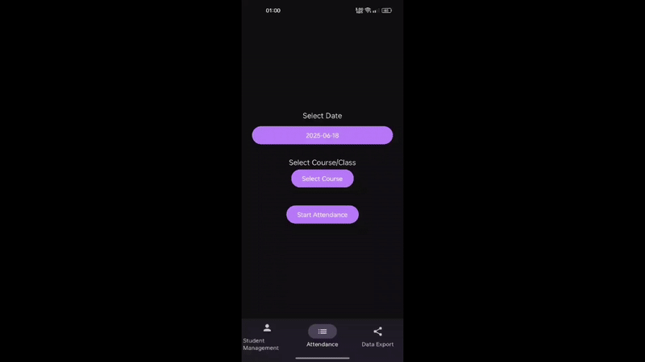
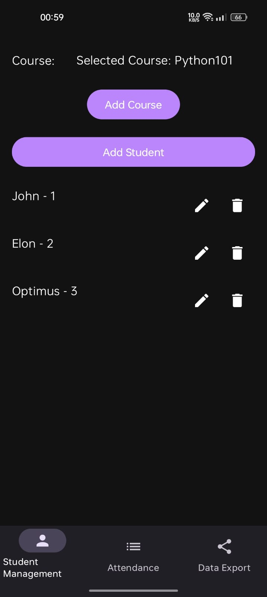
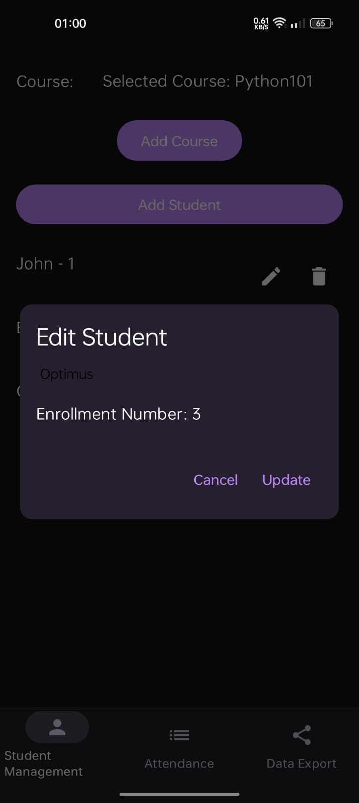

# 📱 Jetpack Compose Attendance App  

A simple yet effective Android application built using **Jetpack Compose** and **Kotlin**, designed to help institutions or educators easily manage student attendance. The app provides a clean, modern UI and intuitive workflows for managing attendance records, exporting data, and handling student information.

---

## 📸 Demo Preview





---

## 🚀 Features  

- 📋 Mark and track student attendance.
- 📊 Export attendance records for review or external storage.
- 🎛️ Manage student information with an easy-to-use interface.
- 🎨 Clean, modern Jetpack Compose UI.
- 🌙 Supports both light and dark themes.
- 📦 Data persistence using Room (or preferred local storage).

---

## 🛠️ Tech Stack  

- **Kotlin**
- **Jetpack Compose**
- **Android Studio**
- **Material Design 3**

---

## 📥 How to Obtain the APK  

Follow these steps to build and obtain the APK using **Android Studio**:

1. **Clone the Repository**
   ```
   git clone https://github.com/yourusername/attendanceapp.git
   cd attendanceapp
    ```

2. **Open in Android Studio**

    Open Android Studio.

    Click File → Open….

    Select the root folder of the project (attendanceapp/).

3. **Sync the Gradle Files**

    Wait for Gradle sync to complete.

    Resolve any dependencies if prompted.

4. **Build the APK**

    Go to the top menu bar → Build → Build Bundle(s) / APK(s) → Build APK(s).

    Wait for the build to finish.

5. **Locate the APK**

    Once built, click locate in the pop-up.

    You’ll find your APK in:
    ```
    app/build/outputs/apk/debug/app-debug.apk
    ```

6. **Install on Your Android Device**

    Transfer the APK to your Android device and install it.

    (Ensure "Install from unknown sources" is enabled on your device settings.)
